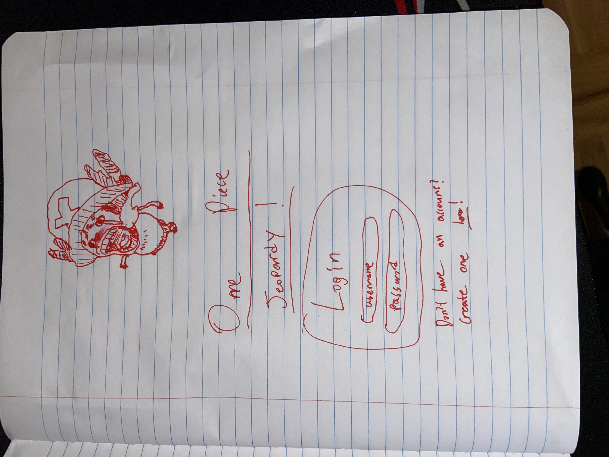
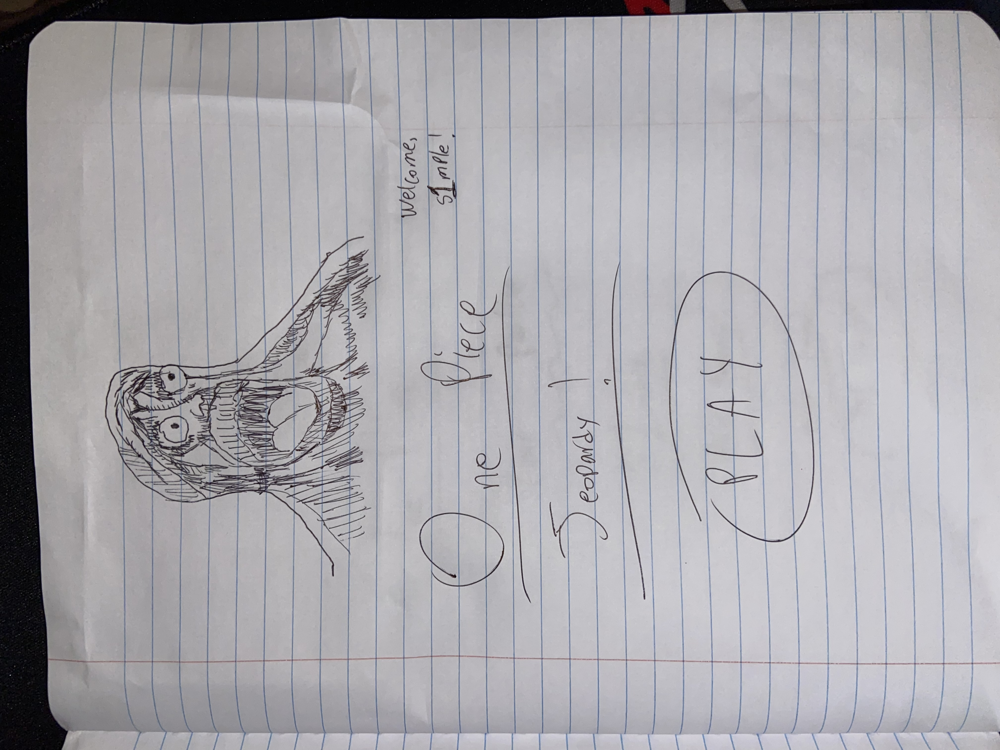
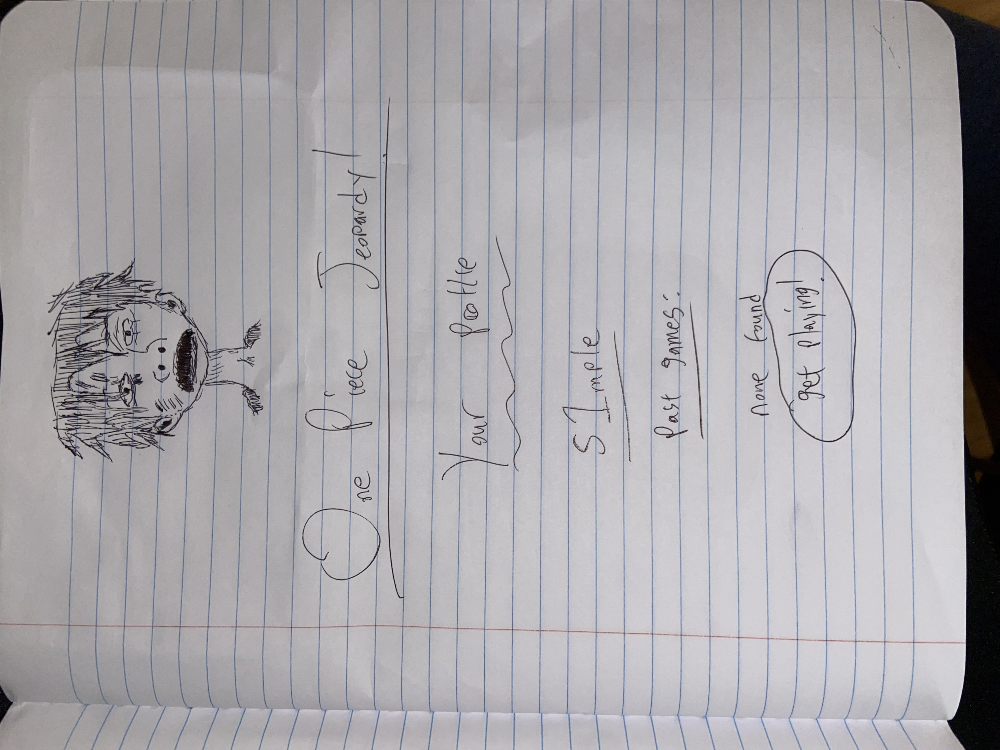
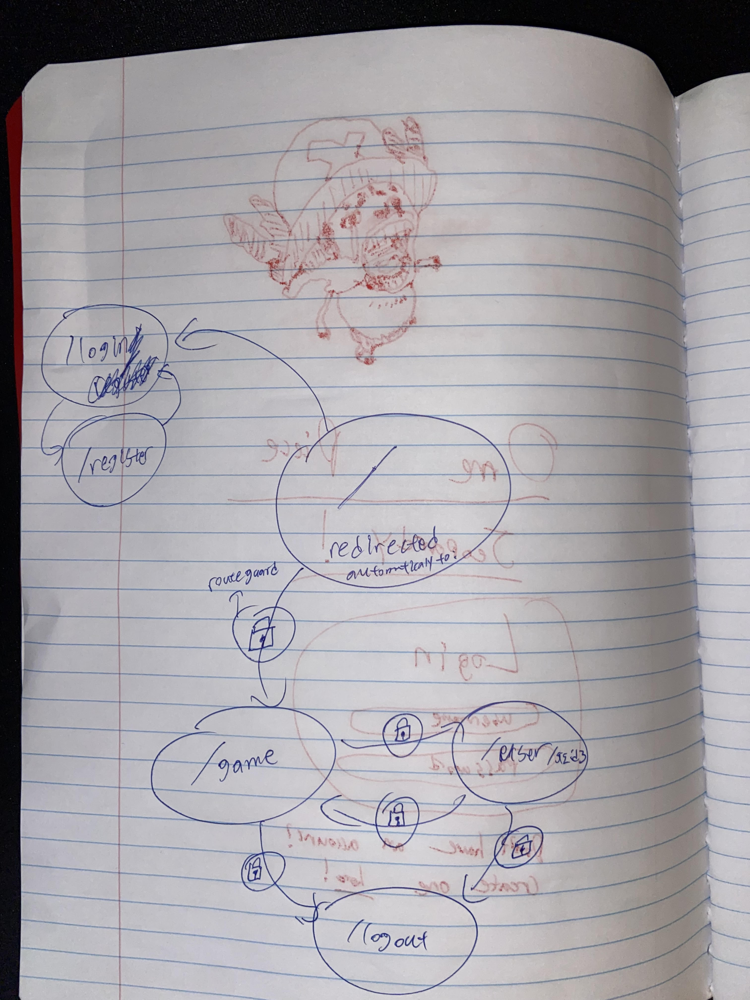

The content below is an example project proposal / requirements document. Replace the text below the lines marked "__TODO__" with details specific to your project. Remove the "TODO" lines.

# One Piece Jeopardy! 

## Overview

*One Piece Jeopardy!* is a jeopardy-style game based off of One Piece. Users will register onto the site to create an account, and then be able to access the game. The game itself is a inquisition of three topics:
* Arcs
* Characters
* Abilities (Haki, Devil Fruit, etc.)

A user would have to pick one of the three categories and answer three questions (randomly selected from stored .json files on backend). Then, a user answers each question to their best of ability (Three tries per question. If you miss it, that's tragic!). After the user completes the game, they have the option to save it to their profile, which they can access anytime to view past games.

By the nature of this game randomly selecting things, functionality will need to be implemented to randomly select three questions from each .json. I'm thinking to implement a cron job at [pythonanywhere](pythonanywhere.com) and run a Python script to use the GitHub API to grab my GitHub credentials and select three questions to use once a day at 12:00 AM UCT. 

## Data Model

The application will store Users and Past Games 

* Users will have the ability to view their past games by a relation
* Past games can be accessed by user via an `id` parameter.
An Example User:

```javascript
{
  username: "Top1WorldBorutoHater",
  passwordHash: "BorutoIsMid!!!" // a password hash, example hash provided
  salt: "pootisspencerhere" // what the password hash is salted with
  pastGames: // an array of references to past games
  sessionId: // a string or null (null added on successful logout, string added as a randomly generated string on successful login)
}
```

An Example of a Past Game:

```typescript
{
  user: // a reference to a User object
  timestamp: Date: // only store day, we don't care about exact time
  score: 5 // each try you lose a point, you get it wrong, no points!
  attempt: {
    // example category, can be abilities, characters, or arcs
    category: "GreenGreenWhatsYourProblemGreenWhatIsYourProblemMeSayAloneRampMeSayAloneRamp"
    questions: [
      {
        question: "This game sucks",
        responses: [ // stores user responses
          "CS2"
        ],
        answer: "CS2",
        points: 3
      },
      {
        question: "This game sucks more",
        responses: [ 
          "Overwatch",
          "Valorant"
        ],
        answer: "VALORANT", // case insensitive detection
        points: 2
      },
        question: "This game is the best of all time",
        responses: [ 
          "The Last of Us",
          "Pokemon: Legends Arceus",
          "JoJo's Bizzare Adventure: Eyes of Heaven"
        ],
        answer: "Team Fortress 2",
        points: 0
    ]
  }
}
```


## [Link to Commented First Draft Schema](backend/db.ts) 

## Wireframes

/login (/register, automatically redirects here by route guard)- login/registration page (share same UI)



/game - page for playing the game (submission/display of day's results all show here via DOM manipulation)



/user/{{ username }} - page for showing user's past games



## Site map



## User Stories or Use Cases

1. as non-registered user, I can register a new account with the site
2. as a user, I can log in to the site
3. as a user, I can view my past games (if any)
4. as a user, I can play the game (if logged in and refreshes, the game data persists as a JWT)

## Research Topics

* (1 point) Integrate user authentication
    * I'm going to be using JWT for user authentication
    * see <code>link/goes/here</code> for register page
    * see <code>link/goes/here</code> for login page
* (1 point) Perform client side form validation w/ custom code
    * see <code>link/goes/here</code>
    * if you try and submit an empty form, it will not let you.
* (1 point) External Library: TypeScript
    * I will use TypeScript.
* (2 points) Unit Testing
    * I will use Jest for my unit tests.
* (3 points (1+1+1)) Vite + React + ESLint
    * I will use Vite + React + ESLint for my frontend. I have experience, so I won't have to learn anything. Because of the overhead added, I'll assign it three (1 + 1 + 1) points.

8 points total out of 8 required points


## [Link to Initial Main Project File](backend/app.ts)

## Annotations / References Used

1. [Vite](https://vitejs.dev/guide/)  -    Vite docs
2. [React](https://react.dev/reference/react) - React docs
3. [TypeScript](https://www.typescriptlang.org/docs/handbook/intro.html)  -  TypeScript docs
4. [Jest](https://jestjs.io/docs/getting-started)  -  Jest docs

